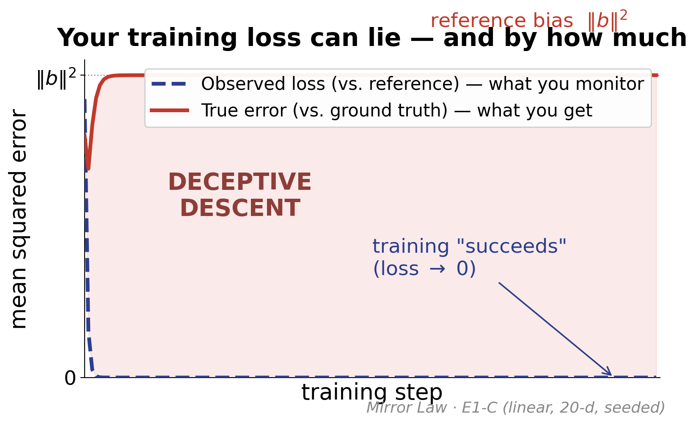

# The Mirror Law

**Reference Quality and the Transfer of Systematic Bias in Imitation and Distillation**

Tom Sarihan · Harrisburg University of Science and Technology · Desnet AI LLC
[ORCID 0009-0003-8391-2303](https://orcid.org/0009-0003-8391-2303)
[](https://doi.org/10.5281/zenodo.21282027)
[](https://doi.org/10.5281/zenodo.21750441)
&nbsp;License: code Apache-2.0 · paper CC-BY-4.0

---

When a model is trained to match a reference — a teacher network in knowledge distillation, or a reward model
in RLHF — it never observes its own error against ground truth, only its **disagreement with the reference**.
For squared loss the training residual decomposes exactly as the difference of two error fields,
`D(x) = e_θ(x) − δ(x)`, so an expressive learner reproduces the reference's error field. Splitting that error
into a systematic part (**bias**) and a zero-mean part (**noise**) yields three regimes: a faithful reference
gives truth; a noisy reference washes out under averaging; a **biased** reference is *cloned* — while the
training loss falls toward zero and the true error plateaus at the bias magnitude. The failure is invisible
from the optimization trajectory alone. We call it **deceptive descent**.



*The observed loss (what you monitor) collapses to zero while the true error (what you get) plateaus at the
reference's bias `‖b‖²`. Real data from experiment E1-C.*

## Contributions
- **Mirror decomposition** — the observable residual is the difference of the learner's and reference's errors.
- **Three-regime taxonomy** — faithful / noisy / biased, with the noise-vs-bias asymmetry.
- **Deceptive descent & trajectory undetectability** — the bias is unidentifiable from the loss curve alone;
  detection provably requires ground-truth probes or a decorrelated second reference.
- **Calibration / graduation criterion** — an operational rule for when a reference may be trusted.
- **Non-realizable refinement** — a finite-capacity learner inherits only the representable bias `Π_H b`.
- **Bradley–Terry result** — preference learning (RLHF/RLAIF) is a mirror; the reward model clones annotator bias.
- **Mirror Audit Protocol** — grade references, detect deceptive descent, decide when to stop/graduate/decorrelate.

The estimator-level facts are classical (Bates & Granger 1969; Borup & Andersen 2021; Das & Sanghavi 2023;
Menon et al. 2021; Lukasik et al. 2022; Gao et al. 2023; D'Amour et al. 2020; Lee et al. 2023). The
contribution is the **synthesis**.

## Repository layout
```
paper/          the manuscript (PDF + LaTeX source + figures)
experiments/    reproduction scripts for E1–E7 (numpy/CPU; E7 needs torch)
figures/        the headline "deceptive descent" figure (paper + social formats)
audit/          the Mirror Audit tools (auditor, ρ estimator, effective-context probe)
```

## Reproduce the results
All synthetic experiments are seeded and run on CPU in seconds to minutes.
```bash
pip install -r requirements.txt
```
| Script | Paper element |
| --- | --- |
| `experiments/e1_experiment.py` | E1 — three regimes, deceptive descent, calibration (Figs. 1, 4–5) |
| `experiments/e1e2_multiseed.py` | E1/E2 multi-seed robustness (12 seeds, CIs) |
| `experiments/e2_experiment.py`, `e2_robustness.py` | E2 — spurious-correlation classification (Fig. 6) |
| `experiments/e3_experiment.py`, `e3_robustness.py` | E3 — proxy-reward over-optimization (Fig. 7) |
| `experiments/rlhf_synthetic.py`, `rlhf_sensitivity.py` | E5 — synthetic RLHF-style pipeline (Figs. 8–9) |
| `experiments/e4_sensitivity.py` | E4 — Regime-B boundary (Appendix B) |
| `experiments/e6_collapse.py` | E6 — recursive distillation / model collapse |
| `experiments/e_calibration.py`, `e_stopping.py`, `e_mitigation.py`, `e_nonrealizable.py` | calibration, ε-stopping, decorrelated ensembling, Prop. 5 |

E7 (real-LLM DPO on Qwen3.5-0.8B/2B with RLAIF and human-RLHF arms) requires `torch`, `transformers`, and a
GPU; uncomment those lines in `requirements.txt`.

## The Mirror Audit (use it on your own pipeline)
```bash
python audit/mirror_audit.py      # deceptive-descent detector + d* stopping estimate
python audit/rho_estimator.py     # verify a "decorrelated" reference actually is (gold-centered ρ)
python audit/context_probe.py && python audit/score_context.py   # true effective-context audit
```

## Citation
```bibtex
@article{sarihan2026mirror,
  title   = {The Mirror Law: Reference Quality and the Transfer of Systematic Bias in Imitation and Distillation},
  author  = {Sarihan, Tom},
  year    = {2026},
  doi     = {10.5281/zenodo.21282027},
  note    = {Preprint}
}
```

## License
Code (`experiments/`, `audit/`) is released under the **Apache License 2.0** (see `LICENSE` and `NOTICE`). Apache-2.0 includes an explicit patent grant and defensive-termination clause.
The paper text and figures (`paper/`, `figures/`) are licensed **CC-BY-4.0**, matching the Zenodo record.

## Archiving
This repository is archived on Zenodo with a permanent DOI: **[10.5281/zenodo.21282027](https://doi.org/10.5281/zenodo.21282027)**.
